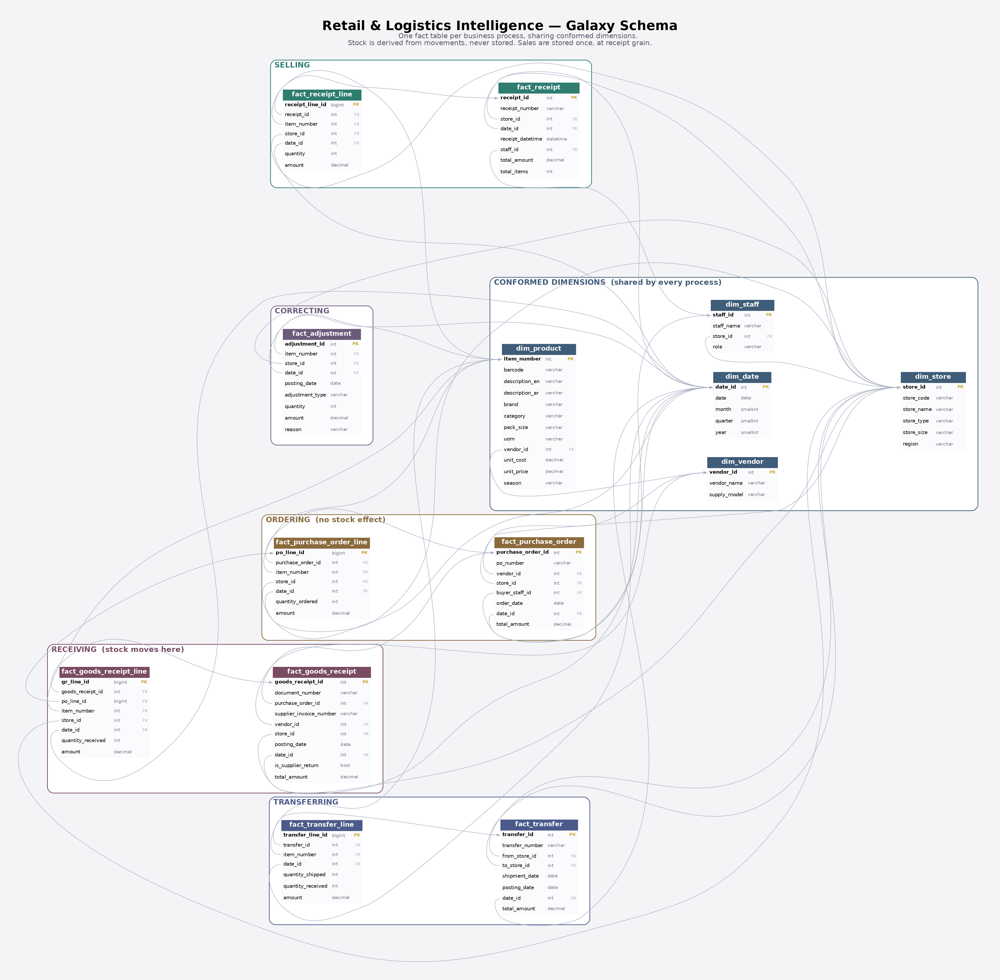

# Retail Dead-Stock Diagnostic

**A dimensional data model and diagnostic layer that turns a "zero sales" report into a costed, root-caused action list for a multi-branch discount grocery chain.**

A conventional slow-mover report answers one question: *which items didn't sell?* It cannot tell you what that costs, and it cannot tell you why — so every dead item gets the same treatment, usually a discount. This project separates the causes and prices each one, because the correct action for seasonal stock is the opposite of the correct action for a genuine assortment failure.

---

## Headline finding

**$677,890 of capital is trapped in stock that has not sold in 90 days** across 18 branches.

| Root cause | Items | Trapped capital | Correct action |
|---|---:|---:|---|
| No demand — genuine assortment failure | 9,186 | $314,111 | Delist, clear, reallocate the shelf |
| Out of season | 7,017 | $258,476 | **Do nothing** — it sells in season |
| Phantom stock — system shows stock, shelf is empty | 888 | $105,303 | Physical count, stop replenishment |
| Negative inventory — blocks auto-replenishment | 2,386 | $0 (clamped) | Fix the records first |

Only 46% of the trapped capital is a true assortment problem. Discounting the 38% that is merely out of season would destroy margin on stock that was going to sell anyway — which is precisely what an uncategorised slow-mover report invites you to do.

Negative stock is clamped to zero for valuation (a negative shelf is a data-integrity fault, not negative capital) and surfaced separately as its own watchlist.

---

## Secondary findings

**Basket size scales with store format; price per item does not.**

| Format | Items per basket | Basket value | Value per item |
|---|---:|---:|---:|
| Large | 6.84 | $30.51 | $4.46 |
| Medium | 4.90 | $21.97 | $4.48 |
| Small | 3.47 | $15.49 | $4.46 |

A large branch's basket is worth twice a small branch's, and none of that gap comes from selling pricier goods. Customers buy *more items* at an identical average price. The lever for a small branch is basket breadth — adjacency, assortment, layout — not trading customers up.

**Supplier lead time varies four-fold, from 4.8 to 19.8 days.** Long lead times force larger safety stock, which is itself a source of trapped capital. Vendor-managed and direct-store-delivery suppliers are excluded from this measure: their order and delivery are the same event, so lead time is undefined rather than zero.

**Every branch breaches the 100-item negative-inventory threshold**, ranging from 202 to 287 items. A threshold that nothing passes indicates a systemic process failure in receiving and counting, not a handful of underperforming branches.

**In-transit loss totals 2,402 units ($8,175)** across 1,188 transfer lines — stock that left one branch and never arrived at another. This is only measurable because a transfer is modelled as a document with two stores rather than as two unrelated movements.

---

## Data model

A **galaxy schema** (fact constellation): one fact table per business process, sharing conformed dimensions. 14 tables, 35 foreign keys, ~6.66M rows.



| Process | Tables | Moves stock? |
|---|---|---|
| Selling | `fact_receipt` → `fact_receipt_line` | Yes |
| Ordering | `fact_purchase_order` → `fact_purchase_order_line` | **No** |
| Receiving | `fact_goods_receipt` → `fact_goods_receipt_line` | Yes |
| Transferring | `fact_transfer` → `fact_transfer_line` | Yes |
| Correcting | `fact_adjustment` | Yes |

Conformed dimensions: `dim_date`, `dim_store`, `dim_product`, `dim_vendor`, `dim_staff`.

### Design decisions

**Ordering and receiving are separate processes.** Raising a purchase order does not move stock — it is a promise. Stock moves on receipt. Collapsing the two would inflate inventory by every open PO and make the dead-stock figure fiction. `fact_purchase_order` therefore appears nowhere in the movement ledger.

**A purchase order line can be received more than once.** Partial deliveries and separate supplier invoices are the norm, so ordered and received quantities cannot share a row. Receipts are aggregated to PO-line grain *before* joining; joining the one-to-many directly fans out `quantity_ordered` and deflates the fill rate — 75.8% instead of the true 88.4% in testing.

**A transfer has two stores.** A single-store movement table cannot express it. The header carries origin and destination; the movement view projects each transfer line into two rows, an outflow at origin and an inflow at destination. The difference between shipped and received is the in-transit loss.

**Deliveries can arrive with no purchase order.** Vendor-managed inventory and direct-store-delivery suppliers set their own quantities on arrival, so `purchase_order_id` is nullable and those vendors are flagged for exclusion from lead-time analysis.

**Adjustments carry a signed quantity.** Shrinkage, damage and expiry only reduce stock, but a physical count corrects in either direction — a count that finds more than the system shows is how phantom stock gets cleared. A type-implied direction cannot express that.

**Sales are stored once, at receipt-line grain, and never copied into a movement table.** Daily sales and stock on hand are views. Storing an aggregate that can be derived is how two numbers in the same business start disagreeing.

**Stock on hand is never stored.** It is reconstructed from the movement ledger with a window function, and reconciles exactly against an independent aggregate across all 89,464 item-store pairs.

---

## Repository

```
scripts/generate.py      synthetic data generator (seeded, reproducible)
scripts/make_diagram.py  ER diagram + DBML, generated from the live schema
sql/01_schema.sql        DDL — 14 tables, 8 indexes
sql/02_load.sql          bulk load via \copy, FK-safe order
sql/03_views.sql         10 analytical views
docs/                    schema diagram (PNG, SVG) and DBML source
```

The generated CSVs (~250MB) are deliberately not committed. The generator and its seed reproduce them byte for byte, so the repository stores the source rather than the output.

The ER diagram is generated by reading `information_schema` from the live database, so the picture cannot drift from the schema it documents.

## Reproducing it

```bash
createdb retail_intelligence
python3 scripts/generate.py --profile full --outdir data
psql -d retail_intelligence -f sql/01_schema.sql
cd data && psql -d retail_intelligence -f ../sql/02_load.sql && cd ..
psql -d retail_intelligence -f sql/03_views.sql
```

Requires PostgreSQL 14+, Python 3.11+ with pandas and numpy, and Graphviz for the diagram. Full profile: 10,000 products, 18 stores, 365 days. A `--profile sample` option generates a small dataset for quick iteration.

## Analytical views

| View | Answers |
|---|---|
| `vw_stock_movement` | The unified ledger — every stock-affecting event from four processes |
| `vw_daily_stock_balance` | Running stock balance per item, store and day |
| `vw_stock_on_hand` | Closing balance per item and store |
| `vw_daily_sales` | Units and revenue by item, store and day |
| `vw_dead_stock_diagnostic` | Trapped capital with root cause |
| `vw_negative_inventory` | Branches breaching the negative-stock threshold |
| `vw_supplier_performance` | Lead time and fill rate, VMI-aware |
| `vw_transfer_loss` | Units and value lost in transit |
| `vw_basket_profile` | Basket size by count and value, per format |
| `vw_format_demand` | Sell-through across pack sizes of the same brand |

---

## Scope and limitations

The data is **synthetic**, generated to exhibit the conditions the diagnostic is built to detect: slow and dead demand tiers, seasonal stock, phantom stock arising from a buyer reordering against a system figure the shelf does not support, negative inventory from cut-off errors, and in-transit loss. The problems are planted; the *detection logic* is not told where they are, so the diagnostic has to find them.

Consequences worth stating plainly:

- **Fill rate does not discriminate between suppliers.** The ten worst span 87.2%–87.9%, because the generator applies a common delivery probability. Lead time varies realistically; fill rate does not. It is reported but should not be read as a supplier scorecard.
- **Pack-size stock value is confounded by unit cost.** Larger packs cost more, so they show more capital per item regardless of demand. Answering the cannibalisation question properly requires a sell-through measure that normalises pack size out — not yet built.
- The model omits promotions, price history, supplier lead-time agreements, and an `entered_at` audit column for late-arriving corrections. Each was considered and scoped out rather than overlooked.

## Stack

PostgreSQL 14 · Python 3.11 (pandas, numpy) · Graphviz · Power BI (dashboard layer)
